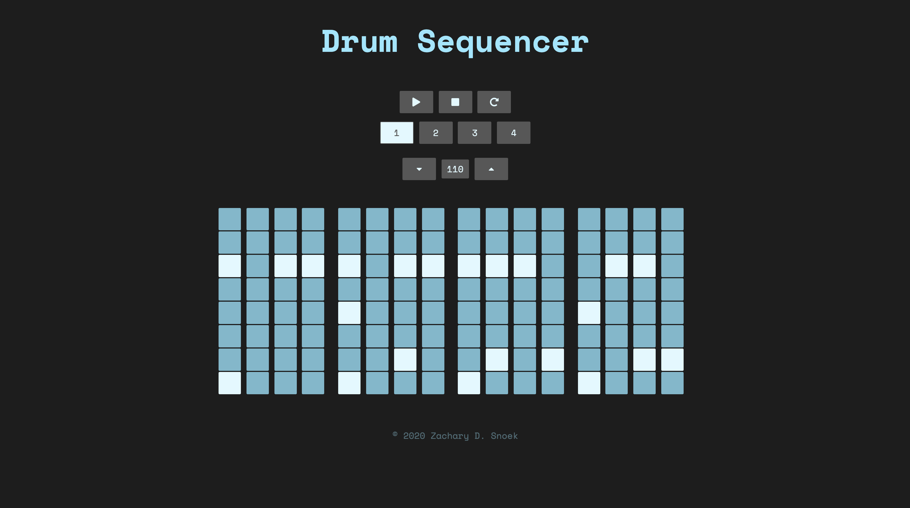
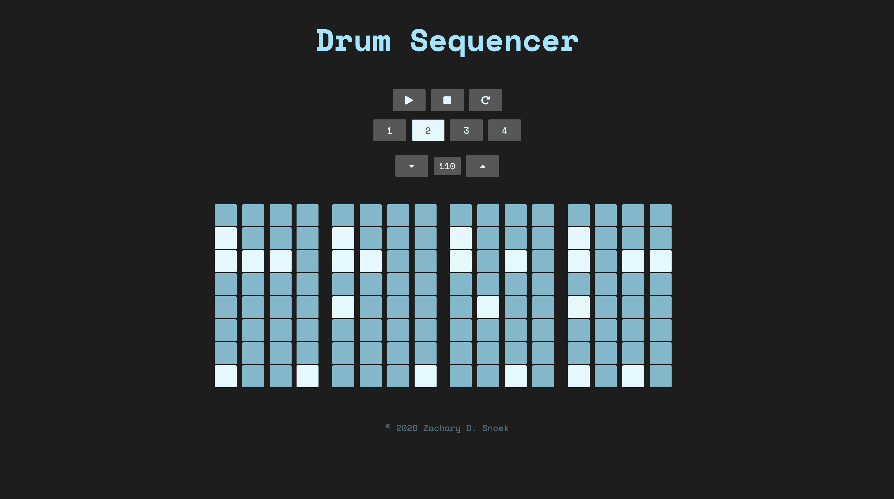

# sequencer

## Description
This is a simple drum sequencer created with HTML, CSS, and JavaScipt. It is designed to be as minimal as possible while offering the user support for multiple patterns and tempo control.

The sequencer is highly flexible and allows for customization of 
* Number of samples
* Number of beat patterns
* Minimum and maximum tempos; tempo increment/decrement step
* Number of measures
* Number of beats in a measure (subdivision)

Try the live demo [here](https://zachsnoek.github.io/drum-sequencer/).

## Future Improvements
* Beat highlighting for each subdivision
* Swung rhythms
* Improved markup and styling

## Images

